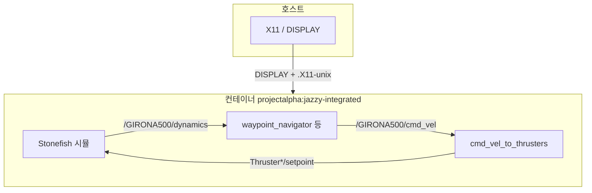
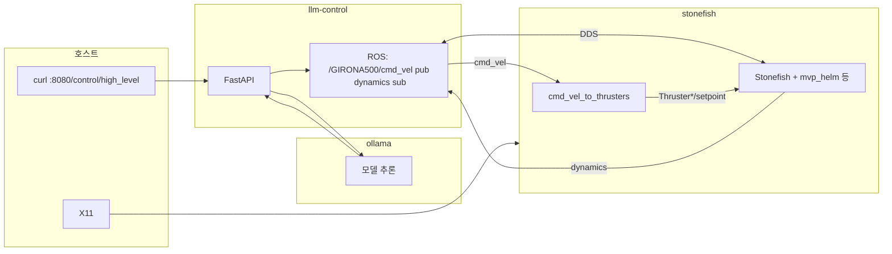

# Docker

**ROS 2 Jazzy.** Stonefish 소스는 서브모듈 `stonefish/`를 빌드 컨텍스트로만 사용합니다 (`--build-context stonefish=./stonefish`). 상세 시나리오·가이드는 루트 `*_GUIDE.md` 를 참고합니다.

## 통합 이미지

| 태그 | Dockerfile | 내용 |
|------|------------|------|
| `projectalpha:jazzy-integrated` | [`integrated/Dockerfile`](integrated/Dockerfile) | Stonefish `/usr/local` + `src/` 전체 `colcon build` → `/ws/install` |

```bash
docker buildx build -f docker/integrated/Dockerfile --build-context stonefish=./stonefish \
  -t projectalpha:jazzy-integrated --load .
```

- 베이스: `osrf/ros:jazzy-desktop-full`. `colcon build`에 **`--symlink-install` 없음** (`stonefish_ros2/data/` 대용량 설치 이슈 회피).
- upstream Stonefish **`Tests/` 콘솔 실행 파일**(ConsoleTest 등)은 이 Dockerfile에서 빌드하지 않습니다.

통합 이미지에 **CycloneDDS RMW** 패키지(`ros-jazzy-rmw-cyclonedds-cpp`)가 포함되어 있으면 `RMW_IMPLEMENTATION=rmw_cyclonedds_cpp` 로 다른 컨테이너와 맞출 수 있습니다.

## 통합 이미지 실행 방법 (`docker run`)

**전제:** 위 빌드로 `projectalpha:jazzy-integrated` 태그가 있어야 합니다. 빌드 시 **`stonefish` 서브모듈**이 필요합니다.

RViz·Stonefish·`xterm` 보조 창 등 **GUI**가 필요하면 호스트에서 X11을 컨테이너에 넘깁니다.

```bash
xhost +local:docker
docker run --rm -it --network host \
  -e DISPLAY \
  -v /tmp/.X11-unix:/tmp/.X11-unix \
  projectalpha:jazzy-integrated bash
```

GPU가 필요하면(호스트에 [NVIDIA Container Toolkit](https://docs.nvidia.com/datacenter/cloud-native/container-toolkit/install-guide.html) 등) 예시처럼 추가합니다.

```bash
docker run --rm -it --network host --gpus all \
  -e DISPLAY \
  -v /tmp/.X11-unix:/tmp/.X11-unix \
  projectalpha:jazzy-integrated bash
```

**컨테이너 안**에서 워크스페이스를 소스한 뒤 원하는 런치를 실행합니다.

```bash
source /ws/install/setup.bash
ros2 launch eroas_navigation girona500_waypoint_test.launch.py
```

아래 표의 다른 `ros2 launch …` 도 **같은 전제**(`source /ws/install/setup.bash`, GUI 런치면 `DISPLAY`·위 `docker run` 플래그)로 실행하면 됩니다.

- 일부 런치는 **`xterm`** 으로 보조 창을 띄웁니다. 이미지에 `xterm`이 포함되어 있으며, **`DISPLAY`** 가 없으면 실패합니다.
- **키보드 텔레옵** 런치는 터미널 포커스와 **`docker run -it`** 가 필요합니다.
- **시나리오 데이터:** `girona500auv_console.scn` 및 GIRONA500 메시 등은 빌드 시 `stonefish/Tests/Data`에서 `stonefish_ros2/data/`로 복사됩니다.

작업이 끝나면 호스트에서 `xhost -local:docker` 로 되돌리는 것이 좋습니다.

### 제어 흐름 (웨이포인트 예)



### 예시 `ros2 launch` (통합 이미지·같은 전제)

**`eroas_navigation`**

| 명령 | 요약 |
|------|------|
| `ros2 launch eroas_navigation girona500_waypoint_test.launch.py` | 웨이포인트 + 시뮬·시각화(기본 데모) |
| `ros2 launch eroas_navigation girona500_eroas.launch.py` | EROAS 단일 목표 |
| `ros2 launch eroas_navigation girona500_fls_test.launch.py` | FLS + EROAS |
| `ros2 launch eroas_navigation girona500_fls_obstacle_course.launch.py` | FLS 장애물 코스 |
| `ros2 launch eroas_navigation girona500_eroas_canyon.launch.py` | 캐니언 + EROAS |

**`stonefish_ros2`**

| 명령 | 요약 |
|------|------|
| `ros2 launch stonefish_ros2 girona500_mvp.launch.py` | 시뮬 + `mvp_control` 등 풀 스택 |
| `ros2 launch stonefish_ros2 girona500_mvp_sim_only.launch.py` | 시뮬 + `mvp_helm` (`mvp_control` 없음) |
| `ros2 launch stonefish_ros2 girona500_mvp_rviz.launch.py` | MVP + RViz |
| `ros2 launch stonefish_ros2 stonefish_simulator.launch.py` | 시뮬 노드만 |
| `ros2 launch stonefish_ros2 stonefish_simulator_nogpu.launch.py` | GPU 없이 시뮬 변형 |
| `ros2 launch stonefish_ros2 girona500_teleop.launch.py` | GIRONA500 키보드 텔레옵 |
| `ros2 launch stonefish_ros2 custom_auv_teleop.launch.py` | 커스텀 AUV 텔레옵 |
| `ros2 launch stonefish_ros2 custom_auv_test.launch.py` | `custom_auv.scn` 테스트 |

절차·기대 동작은 루트 [`WAYPOINT_TEST_GUIDE.md`](../WAYPOINT_TEST_GUIDE.md), [`EROAS_WAYPOINT_TEST_GUIDE.md`](../EROAS_WAYPOINT_TEST_GUIDE.md), [`FLS_TEST_GUIDE.md`](../FLS_TEST_GUIDE.md), [`PROJECT_TEST_GUIDE.md`](../PROJECT_TEST_GUIDE.md), [`MVP_INSTALLATION_GUIDE.md`](../MVP_INSTALLATION_GUIDE.md) 등을 참고합니다.

## LLM 스택 (`compose.llm.yaml`)

세 서비스: **`stonefish`** · **`ollama`** · **`llm-control`**. 같은 `ROS_DOMAIN_ID`, 기본 `rmw_fastrtps_cpp`. `stonefish`는 [`stonefish-llm-stack.sh`](stonefish-llm-stack.sh)로 `cmd_vel_to_thrusters` + `girona500_mvp_sim_only` 를 같이 띄웁니다(sim_only만으로는 `cmd_vel` 경로가 없음).



**실행 (저장소 루트)**

```bash
xhost +local:docker
export DISPLAY="${DISPLAY:-:0}"
docker compose -f docker/compose.llm.yaml build llm-control
docker compose -f docker/compose.llm.yaml up --build
docker compose -f docker/compose.llm.yaml exec ollama ollama pull medgemma:4b
curl -s http://127.0.0.1:8080/health
curl -s http://127.0.0.1:8080/control/high_level -H 'Content-Type: application/json' \
  -d '{"instruction":"천천히 전진"}'
```

| 항목 | 내용 |
|------|------|
| GPU | `compose.llm.yaml`에 `ollama`·`stonefish`용 NVIDIA `deploy` 기본 포함. **GPU 없으면** 해당 `deploy` 블록 주석 처리. |
| 화면 | `DISPLAY` + `/tmp/.X11-unix` 기본 마운트. |
| `controller/set` WARN | `mvp_sim_only`는 `mvp_control` 없음 → `mvp_helm` 경고는 **cmd_vel 추력 경로와 무관**하게 나올 수 있음. |
| Ollama | `OLLAMA_MODEL`, `OLLAMA_HOST` 환경변수. 휴리스틱만: `LLM_DUMMY=1` (`llm-control`). |
| 마무리 | `xhost -local:docker` |

## 참고

- [`.dockerignore`](../.dockerignore)
