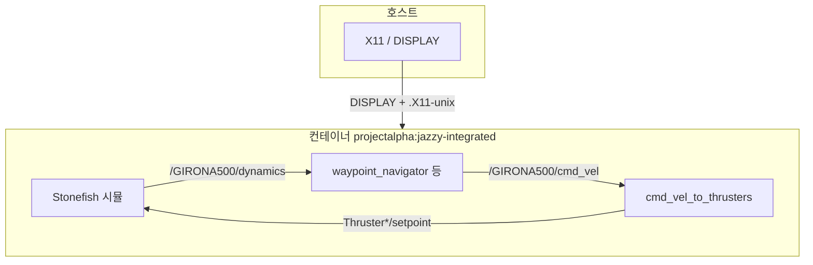
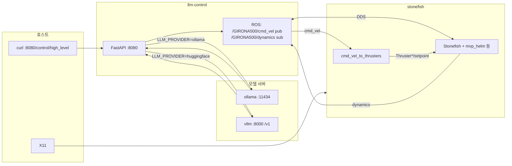

# Docker

**ROS 2 Jazzy.** Stonefish 소스는 서브모듈 `stonefish/`를 빌드 컨텍스트로만 사용합니다 (`--build-context stonefish=./stonefish`). 상세 시나리오·가이드는 루트 `*_GUIDE.md` 를 참고합니다.

## 통합 이미지

| 태그 | Dockerfile | 내용 |
|------|------------|------|
| `projectalpha:jazzy-integrated` | [`integrated/Dockerfile`](integrated/Dockerfile) | Stonefish `/usr/local` + `src/` 전체 `colcon build` → `/ws/install` |

```bash
docker buildx build -f docker/integrated/Dockerfile --build-context stonefish=./stonefish \
  -t projectalpha:jazzy-integrated --load .
```

- 베이스: `osrf/ros:jazzy-desktop-full`. `colcon build`에 **`--symlink-install` 없음** (`stonefish_ros2/data/` 대용량 설치 이슈 회피).
- upstream Stonefish **`Tests/` 콘솔 실행 파일**(ConsoleTest 등)은 이 Dockerfile에서 빌드하지 않습니다.
- 통합 이미지에 **CycloneDDS RMW** 패키지(`ros-jazzy-rmw-cyclonedds-cpp`)가 포함되어 있으면 `RMW_IMPLEMENTATION=rmw_cyclonedds_cpp` 로 다른 컨테이너와 맞출 수 있습니다.

## 통합 이미지 실행 방법 (`docker run`)

**전제:** 위 빌드로 `projectalpha:jazzy-integrated` 태그가 있어야 합니다. 빌드 시 **`stonefish` 서브모듈**이 필요합니다.

RViz·Stonefish·`xterm` 보조 창 등 **GUI**가 필요하면 호스트에서 X11을 컨테이너에 넘깁니다.

```bash
xhost +local:docker
docker run --rm -it --network host \
  -e DISPLAY \
  -v /tmp/.X11-unix:/tmp/.X11-unix \
  projectalpha:jazzy-integrated bash
```

GPU가 필요하면(호스트에 [NVIDIA Container Toolkit](https://docs.nvidia.com/datacenter/cloud-native/container-toolkit/install-guide.html) 등) 예시처럼 추가합니다.

```bash
docker run --rm -it --network host --gpus all \
  -e DISPLAY \
  -v /tmp/.X11-unix:/tmp/.X11-unix \
  projectalpha:jazzy-integrated bash
```

**컨테이너 안**에서 워크스페이스를 소스한 뒤 원하는 런치를 실행합니다.

```bash
source /ws/install/setup.bash
ros2 launch eroas_navigation girona500_waypoint_test.launch.py
```

아래 표의 다른 `ros2 launch …` 도 **같은 전제**(`source /ws/install/setup.bash`, GUI 런치면 `DISPLAY`·위 `docker run` 플래그)로 실행하면 됩니다.

- 일부 런치는 **`xterm`** 으로 보조 창을 띄웁니다. 이미지에 `xterm`이 포함되어 있으며, **`DISPLAY`** 가 없으면 실패합니다.
- **키보드 텔레옵** 런치는 터미널 포커스와 **`docker run -it`** 가 필요합니다.
- **시나리오 데이터:** `girona500auv_console.scn` 및 GIRONA500 메시 등은 빌드 시 `stonefish/Tests/Data`에서 `stonefish_ros2/data/`로 복사됩니다.

작업이 끝나면 호스트에서 `xhost -local:docker` 로 되돌리는 것이 좋습니다.

### 제어 흐름 (웨이포인트 예)



### 예시 `ros2 launch` (통합 이미지·같은 전제)

**`eroas_navigation`**

| 명령 | 요약 |
|------|------|
| `ros2 launch eroas_navigation girona500_waypoint_test.launch.py` | 웨이포인트 + 시뮬·시각화(기본 데모) |
| `ros2 launch eroas_navigation girona500_eroas.launch.py` | EROAS 단일 목표 |
| `ros2 launch eroas_navigation girona500_fls_test.launch.py` | FLS + EROAS |
| `ros2 launch eroas_navigation girona500_fls_obstacle_course.launch.py` | FLS 장애물 코스 |
| `ros2 launch eroas_navigation girona500_eroas_canyon.launch.py` | 캐니언 + EROAS |

**`stonefish_ros2`**

| 명령 | 요약 |
|------|------|
| `ros2 launch stonefish_ros2 girona500_mvp.launch.py` | 시뮬 + `mvp_control` 등 풀 스택 |
| `ros2 launch stonefish_ros2 girona500_mvp_sim_only.launch.py` | 시뮬 + `mvp_helm` (`mvp_control` 없음) |
| `ros2 launch stonefish_ros2 girona500_mvp_rviz.launch.py` | MVP + RViz |
| `ros2 launch stonefish_ros2 stonefish_simulator.launch.py` | 시뮬 노드만 |
| `ros2 launch stonefish_ros2 stonefish_simulator_nogpu.launch.py` | GPU 없이 시뮬 변형 |
| `ros2 launch stonefish_ros2 girona500_teleop.launch.py` | GIRONA500 키보드 텔레옵 |
| `ros2 launch stonefish_ros2 custom_auv_teleop.launch.py` | 커스텀 AUV 텔레옵 |
| `ros2 launch stonefish_ros2 custom_auv_test.launch.py` | `custom_auv.scn` 테스트 |

절차·기대 동작은 루트 [`WAYPOINT_TEST_GUIDE.md`](../WAYPOINT_TEST_GUIDE.md), [`EROAS_WAYPOINT_TEST_GUIDE.md`](../EROAS_WAYPOINT_TEST_GUIDE.md), [`FLS_TEST_GUIDE.md`](../FLS_TEST_GUIDE.md), [`PROJECT_TEST_GUIDE.md`](../PROJECT_TEST_GUIDE.md), [`MVP_INSTALLATION_GUIDE.md`](../MVP_INSTALLATION_GUIDE.md) 등을 참고합니다.

## LLM 스택 (`compose.llm.yaml`)

기본 서비스는 **`stonefish`** · **`ollama`** · **`llm-control`** 입니다. Hugging Face 로컬 추론을 compose 안에서 실행할 경우 **`vllm`** 서비스를 추가로 사용할 수 있습니다.

- 같은 `ROS_DOMAIN_ID`를 사용합니다.
- 기본 RMW는 `rmw_fastrtps_cpp` 입니다.
- `stonefish`는 [`stonefish-llm-stack.sh`](stonefish-llm-stack.sh)로 `cmd_vel_to_thrusters` + `girona500_mvp_sim_only` 를 같이 띄웁니다.
- `girona500_mvp_sim_only`만 실행하면 `/GIRONA500/cmd_vel` → Thruster setpoint 경로가 없으므로, `cmd_vel_to_thrusters`가 함께 필요합니다.



### LLM 스택 사전 준비 — 통합 이미지 빌드

`stonefish` 서비스는 Docker Hub 이미지가 아니라 로컬에서 빌드한 `projectalpha:jazzy-integrated` 이미지를 사용합니다. 따라서 `compose.llm.yaml`을 실행하기 전에 저장소 루트에서 통합 이미지를 먼저 빌드해야 합니다.

```bash
git submodule update --init --recursive

docker buildx build -f docker/integrated/Dockerfile \
  --build-context stonefish=./stonefish \
  -t projectalpha:jazzy-integrated \
  --load .
```

빌드 여부는 아래 명령으로 확인합니다.

```bash
docker images | grep projectalpha
```

아래와 같이 `projectalpha:jazzy-integrated` 이미지가 보여야 합니다.

```text
projectalpha   jazzy-integrated
```

`projectalpha:jazzy-integrated` 이미지가 없으면 `docker compose up` 실행 시 Docker Hub에서 `projectalpha` 이미지를 pull하려고 하며, 아래와 같은 오류가 발생할 수 있습니다.

```text
pull access denied for projectalpha, repository does not exist or may require 'docker login'
```

이 오류는 Docker Hub 로그인 문제가 아니라, 로컬 통합 이미지가 아직 빌드되지 않았다는 의미입니다.

### 실행 — Ollama 기본 구성

`docker/llm-settings.env`가 Ollama 기준일 때 사용합니다.

```bash
xhost +local:docker
export DISPLAY="${DISPLAY:-:0}"

# Ollama 구성에서는 필요한 서비스만 실행
docker compose -f docker/compose.llm.yaml up --build stonefish ollama llm-control
```

Ollama 모델은 컨테이너 안에 받아 둔 태그와 `OLLAMA_MODEL` 값이 같아야 합니다.

```bash
docker compose -f docker/compose.llm.yaml exec ollama ollama pull medgemma:4b
# 다른 모델 쓰려면 docker/llm-settings.env 의 OLLAMA_MODEL 과 동일한 태그로 pull
```

상태 확인과 제어 요청:

```bash
curl -s http://127.0.0.1:8080/health

curl -s http://127.0.0.1:8080/control/high_level \
  -H 'Content-Type: application/json' \
  -d '{"instruction":"천천히 전진"}'
```

Hugging Face/vLLM 구성을 사용할 때는 `ollama pull` 단계가 필요하지 않습니다. `docker/llm-settings.env`에서 `LLM_PROVIDER=huggingface`와 `HF_API_BASE`를 먼저 설정한 뒤 실행합니다.

## Hugging Face 백엔드

`llm-control`의 Hugging Face 백엔드는 모델을 직접 로드하지 않고, OpenAI 호환 **`/v1/chat/completions`** 엔드포인트에 HTTP 요청을 보냅니다.

즉, `LLM_PROVIDER=huggingface`일 때의 핵심 설정은 아래 2개입니다.

```bash
HF_API_BASE=...
HUGGINGFACE_MODEL=...
```

`HF_API_BASE`에 따라 실행 위치가 달라집니다.

| 실행 방식 | HF_API_BASE |
|----------|-------------|
| Hugging Face 원격 라우터 | `https://router.huggingface.co/v1` |
| 호스트에서 vLLM/TGI 실행 | `http://host.docker.internal:<포트>/v1` |
| compose 내부 `vllm` 서비스 실행 | `http://vllm:8000/v1` |

`HUGGINGFACE_MODEL`은 해당 서버가 요구하는 `model` 문자열과 같아야 합니다. vLLM에서는 일반적으로 `vllm serve` 또는 vLLM 컨테이너 `--model`에 준 모델 id와 동일하게 둡니다.

### Hugging Face — 원격 라우터

`LLM_PROVIDER=huggingface` + `HF_API_BASE=https://router.huggingface.co/v1` 이면 Hugging Face Inference Providers를 사용합니다.

토큰은 [HF Access Tokens](https://huggingface.co/settings/tokens)에서 발급합니다.

```bash
export HF_TOKEN="hf_xxxxxxxx"   # 커밋·공유 금지
```

`docker/llm-settings.env` 예:

```bash
LLM_PROVIDER=huggingface
HF_API_BASE=https://router.huggingface.co/v1
HUGGINGFACE_MODEL=Qwen/Qwen2.5-3B-Instruct:hf-inference
LLM_DUMMY=0
LLM_CONTROL_PORT=8080
```

`/health`에서 `hf_hub_token_required=true`이고 `hf_token_configured=true`인지 확인합니다.

```bash
curl -s http://127.0.0.1:8080/health
```

### Hugging Face — 로컬 추론 공통

로컬 추론은 Hugging Face 서버가 아니라 사용자의 PC 또는 compose 내부 컨테이너에서 모델을 실행하는 방식입니다. `llm-control`은 여전히 `LLM_PROVIDER=huggingface`로 두고, `HF_API_BASE`만 로컬 OpenAI 호환 `/v1` 엔드포인트로 바꿉니다.

공개 모델이면 Hub 토큰이 없어도 모델 다운로드가 가능한 경우가 많습니다. 단, gated/private 모델은 로컬 vLLM/TGI에서도 모델 다운로드를 위해 `HF_TOKEN`이 필요할 수 있습니다.

### vLLM — 호스트 스크립트로 실행

호스트에 GPU와 vLLM이 있으면 [`docker/scripts/run-vllm-local.sh`](scripts/run-vllm-local.sh)로 서버를 띄웁니다.

공식 문서: [vLLM OpenAI-compatible server](https://docs.vllm.ai/en/latest/serving/openai_compatible_server.html)

1. 설치

```bash
pip install vllm
# gated/private HF 모델이면:
# export HF_TOKEN=hf_...
```

2. 실행

```bash
chmod +x docker/scripts/run-vllm-local.sh
./docker/scripts/run-vllm-local.sh
```

모델·포트·추가 인자 예시:

```bash
VLLM_MODEL=Qwen/Qwen2.5-3B-Instruct VLLM_PORT=8000 \
  ./docker/scripts/run-vllm-local.sh --dtype auto
```

기본은 `0.0.0.0:8000`입니다. 기동 확인:

```bash
curl -s http://127.0.0.1:8000/v1/models
```

3. `docker/llm-settings.env`

vLLM 포트가 8000일 때:

```bash
LLM_PROVIDER=huggingface
HF_API_BASE=http://host.docker.internal:8000/v1
HUGGINGFACE_MODEL=Qwen/Qwen2.5-3B-Instruct
LLM_DUMMY=0
LLM_CONTROL_PORT=8080
```

`HUGGINGFACE_MODEL`은 `vllm serve`에 준 모델 id와 동일해야 합니다.

4. vLLM `--api-key` 사용 시

`llm-control`은 `HF_TOKEN` 또는 `HUGGINGFACE_HUB_TOKEN`이 있으면 `Authorization: Bearer ...` 헤더를 붙입니다. vLLM 서버를 `--api-key`로 띄운 경우, 같은 값을 호스트에서 `export HF_TOKEN=...` 한 뒤 compose를 실행합니다.

5. Docker 네트워크

Linux에서는 `compose.llm.yaml`의 `llm-control.extra_hosts`에 아래 설정이 있어야 컨테이너에서 호스트 vLLM에 접근할 수 있습니다.

```yaml
extra_hosts:
  - "host.docker.internal:host-gateway"
```

실행:

```bash
export DISPLAY="${DISPLAY:-:0}"
docker compose -f docker/compose.llm.yaml up --build stonefish llm-control
```

상태 확인:

```bash
curl -s http://127.0.0.1:8080/health

curl -s http://127.0.0.1:8080/control/high_level \
  -H 'Content-Type: application/json' \
  -d '{"instruction":"slowly move forward"}'
```

### vLLM — compose 서비스로 실행

vLLM을 호스트에서 별도로 실행하지 않고 `compose.llm.yaml` 안의 서비스로 함께 띄울 수도 있습니다. 이 경우 `llm-control`은 호스트 주소가 아니라 같은 Docker 네트워크의 서비스 이름으로 vLLM에 접근합니다.

이 방식에서는 `HF_API_BASE`를 아래처럼 둡니다.

```bash
LLM_PROVIDER=huggingface
HF_API_BASE=http://vllm:8000/v1
HUGGINGFACE_MODEL=LGAI-EXAONE/EXAONE-3.5-2.4B-Instruct
LLM_DUMMY=0
LLM_CONTROL_PORT=8080
```

`HF_API_BASE=http://vllm:8000/v1`은 `compose.llm.yaml` 안에 서비스 이름이 `vllm`인 컨테이너가 있고, `llm-control`과 같은 Docker 네트워크에 있을 때만 동작합니다.

`compose.llm.yaml` 확인 항목:

- `vllm` 서비스가 `networks: [robot_dds]`에 포함되어 있어야 합니다.
- `llm-control.depends_on`에 `vllm`을 추가합니다.
- Hugging Face 모델 캐시를 유지하려면 `hf_cache` 볼륨을 추가합니다.
- vLLM 사용 시 `ollama`는 필수가 아닙니다. GPU 메모리가 부족하면 `ollama` 서비스를 함께 띄우지 않는 구성을 권장합니다.

`compose.llm.yaml`에 추가할 수 있는 예시는 아래와 같습니다.

```yaml
services:
  vllm:
    # V100(sm70) 환경에서는 latest 이미지가 동작하지 않을 수 있으므로
    # v0.6.6.post1 + --dtype half 조합을 우선 사용합니다.
    image: vllm/vllm-openai:v0.6.6.post1
    container_name: vllm
    hostname: vllm
    networks: [robot_dds]
    ports:
      - "8000:8000"
    ipc: host
    volumes:
      - hf_cache:/root/.cache/huggingface
    environment:
      NVIDIA_VISIBLE_DEVICES: all
      NVIDIA_DRIVER_CAPABILITIES: compute,utility
      HF_TOKEN: ${HF_TOKEN:-}
      HUGGINGFACE_HUB_TOKEN: ${HUGGINGFACE_HUB_TOKEN:-}
    command:
      - --model
      - LGAI-EXAONE/EXAONE-3.5-2.4B-Instruct
      - --dtype
      - half
      - --trust-remote-code
      - --host
      - 0.0.0.0
      - --port
      - "8000"
    deploy:
      resources:
        reservations:
          devices:
            - driver: nvidia
              count: 1
              capabilities: [gpu]

  llm-control:
    depends_on:
      - stonefish
      - vllm

volumes:
  ollama_data:
  hf_cache:
```

이미 `services:`와 `volumes:`가 있는 compose 파일에 붙이는 경우, 중복 선언하지 말고 기존 `services:` 아래에는 `vllm` 서비스만 추가하고, 기존 `volumes:` 아래에는 `hf_cache:`만 추가합니다.

V100 계열 GPU는 `bfloat16`을 지원하지 않으므로 `--dtype half`를 사용합니다. A100 이상 계열에서는 `bfloat16`을 사용할 수 있습니다.

#### EXAONE 모델 사전 다운로드

처음 실행 시 vLLM이 Hugging Face Hub에서 모델을 자동 다운로드하지만, 다운로드 시간이 길거나 로딩 상태를 구분하기 어려울 수 있습니다. 이 경우 compose에서 사용하는 `hf_cache` 볼륨에 EXAONE 모델을 미리 받아둘 수 있습니다.

먼저 실제 Hugging Face 캐시 볼륨 이름을 확인합니다.

```bash
docker volume ls | grep hf_cache
```

예를 들어 결과가 아래처럼 나오면:

```text
local     docker_hf_cache
```

아래처럼 해당 볼륨을 사용해 모델을 미리 다운로드합니다.

```bash
docker run --rm -it \
  --entrypoint /bin/bash \
  -v docker_hf_cache:/root/.cache/huggingface \
  -e HF_TOKEN="${HF_TOKEN:-}" \
  vllm/vllm-openai:v0.6.6.post1 \
  -lc "python3 -c \"from huggingface_hub import snapshot_download; snapshot_download('LGAI-EXAONE/EXAONE-3.5-2.4B-Instruct')\""
```

볼륨 이름이 다르면 `docker_hf_cache` 부분만 실제 볼륨 이름으로 바꿉니다.

자동으로 첫 번째 `hf_cache` 볼륨을 찾아 실행하려면 아래 명령을 사용할 수 있습니다.

```bash
HF_CACHE_VOL=$(docker volume ls --format '{{.Name}}' | grep '_hf_cache$' | head -n 1)
echo "HF cache volume: ${HF_CACHE_VOL}"

docker run --rm -it \
  --entrypoint /bin/bash \
  -v "${HF_CACHE_VOL}:/root/.cache/huggingface" \
  -e HF_TOKEN="${HF_TOKEN:-}" \
  vllm/vllm-openai:v0.6.6.post1 \
  -lc "python3 -c \"from huggingface_hub import snapshot_download; snapshot_download('LGAI-EXAONE/EXAONE-3.5-2.4B-Instruct')\""
```

공개 모델이면 `HF_TOKEN`은 필수가 아니지만, 다운로드 제한이나 속도 문제를 줄이기 위해 토큰을 설정할 수 있습니다.

```bash
export HF_TOKEN="hf_xxxxxxxx"
```

중요: `vllm/vllm-openai` 이미지는 기본 entrypoint가 vLLM API 서버입니다. 따라서 모델 사전 다운로드처럼 Python 명령을 실행할 때는 `--entrypoint /bin/bash`로 entrypoint를 덮어써야 합니다.

`docker/llm-settings.env` 예:

```bash
LLM_PROVIDER=huggingface
HF_API_BASE=http://vllm:8000/v1
HUGGINGFACE_MODEL=LGAI-EXAONE/EXAONE-3.5-2.4B-Instruct
LLM_DUMMY=0
LLM_CONTROL_PORT=8080
```

실행:

```bash
xhost +local:docker
export DISPLAY="${DISPLAY:-:0}"

# vLLM 구성에서는 ollama를 띄우지 않고 필요한 서비스만 실행
docker compose -f docker/compose.llm.yaml up --build stonefish vllm llm-control
```

vLLM 기동 확인은 호스트 터미널에서 실행합니다. `compose.llm.yaml`에서 `"8000:8000"` 포트를 열어두었기 때문에 호스트의 `127.0.0.1:8000`으로 접근할 수 있습니다.

```bash
curl -sS -i http://127.0.0.1:8000/v1/models
```

정상이라면 `HTTP/1.1 200 OK`와 모델 목록이 출력됩니다.

`llm-control` 확인:

```bash
curl -s http://127.0.0.1:8080/health

curl -s http://127.0.0.1:8080/control/high_level \
  -H 'Content-Type: application/json' \
  -d '{"instruction":"천천히 전진"}'
```

`depends_on`은 vLLM 컨테이너의 시작 순서만 보장하고, 모델 로딩 완료까지 보장하지 않습니다. vLLM은 모델 가중치를 로드하는 데 시간이 걸릴 수 있으므로, `/v1/models`가 응답한 뒤 `llm-control` 제어 요청을 보내는 것이 안전합니다.

### TGI 등 다른 로컬 추론 서버

[Text Generation Inference](https://github.com/huggingface/text-generation-inference), LM Studio, llama.cpp server 등 OpenAI 호환 `/v1/chat/completions`를 제공하는 서버도 같은 방식으로 붙일 수 있습니다.

호스트에서 실행한 경우:

```bash
LLM_PROVIDER=huggingface
HF_API_BASE=http://host.docker.internal:<포트>/v1
HUGGINGFACE_MODEL=<서버가 요구하는 model 문자열>
```

compose 내부 서비스로 실행한 경우에는 `host.docker.internal` 대신 해당 서비스 이름을 사용합니다.

```bash
LLM_PROVIDER=huggingface
HF_API_BASE=http://<서비스이름>:<포트>/v1
HUGGINGFACE_MODEL=<서버가 요구하는 model 문자열>
```

## 설정 파일

`llm-control`은 아래 설정을 읽습니다.

- [`docker/llm-settings.env`](llm-settings.env): compose에서 `env_file`로 주입
- [`docker/llm-control/llm_app_settings.json`](llm-control/llm_app_settings.json): 앱 내부 JSON 설정

우선순위는 아래와 같습니다.

```text
환경 변수 → JSON 최상단 → model 객체 → 기본값
```

따라서 `docker/llm-settings.env`에 `LLM_PROVIDER`, `HF_API_BASE`, `HUGGINGFACE_MODEL` 등이 살아 있으면 JSON의 `model.provider`, `model.huggingface_api_base`, `model.huggingface_model`보다 우선 적용됩니다.

JSON만 쓰고 싶다면 해당 키를 `docker/llm-settings.env`에서 주석 처리합니다.

비밀 토큰은 JSON이나 커밋되는 env 파일에 넣지 말고, 호스트 환경 변수로만 전달합니다.

```bash
export HF_TOKEN="hf_xxxxxxxx"
```

## 참고 표

| 항목 | 내용 |
|------|------|
| GPU | `compose.llm.yaml`에 `ollama`·`stonefish`용 NVIDIA `deploy` 기본 포함. compose 내부 vLLM을 쓰면 `vllm` 서비스에도 GPU 설정이 필요합니다. **GPU 없으면** 해당 `deploy` 블록을 주석 처리합니다. |
| V100 GPU | V100(sm70)에서는 `bfloat16`을 사용할 수 없으므로 `--dtype half`를 사용합니다. `vllm/vllm-openai:latest`가 동작하지 않으면 `vllm/vllm-openai:v0.6.6.post1`을 사용합니다. |
| 화면 | `DISPLAY` + `/tmp/.X11-unix` 기본 마운트. |
| `controller/set` WARN | `mvp_sim_only`는 `mvp_control` 없음 → `mvp_helm` 경고는 **cmd_vel 추력 경로와 무관**하게 나올 수 있음. |
| LLM 백엔드 | **`ollama`** 또는 **`huggingface`**. HF는 `HF_API_BASE` + `HUGGINGFACE_MODEL`로 `POST .../v1/chat/completions` 한 경로만 사용합니다. |
| HF 원격 라우터 | `HF_API_BASE=https://router.huggingface.co/v1`, `HF_TOKEN` 필요. |
| 호스트 vLLM/TGI | `HF_API_BASE=http://host.docker.internal:포트/v1`. |
| compose 내부 vLLM | `HF_API_BASE=http://vllm:8000/v1`. |
| 모델 캐시 | compose 내부 vLLM은 `hf_cache:/root/.cache/huggingface` 볼륨을 사용합니다. 모델 로딩이 오래 걸리면 EXAONE 모델을 `hf_cache`에 사전 다운로드합니다. |
| 토큰 | 공개 모델의 로컬 추론은 토큰 없이 가능할 수 있습니다. gated/private 모델 또는 원격 라우터는 `HF_TOKEN`이 필요합니다. |
| 통합 이미지 | LLM 스택 실행 전 `projectalpha:jazzy-integrated` 로컬 빌드가 필요합니다. |
| 설정 우선순위 | 환경 변수 → JSON 최상단 → `model` 객체 → 기본값. |
| 마무리 | `xhost -local:docker` |

## 참고

- [`.dockerignore`](../.dockerignore)
- [vLLM 호스트 실행 스크립트](scripts/run-vllm-local.sh)