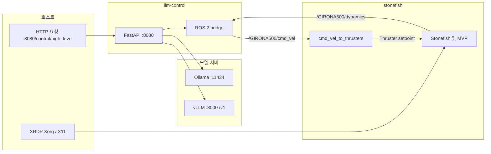

# Docker

> **2026-08-21 staged UMDL validation v0.3**
>
> 실행 순서를 `Stonefish 없이 LLM↔Dataset 검증 → Stonefish 추가 공존 검증`으로 분리했습니다. 기본 Compose는 `vLLM(GPU 0) + llm-control(CPU)`만 시작하고, Stonefish는 `simulation` profile에서만 GPU 1을 사용합니다. GPU 1은 Phase 1에서 선택적으로 두 번째 vLLM에 사용할 수 있습니다.
>
> 가장 먼저 `STAGED_VALIDATION.md`와 `UMDL_BENCHMARK.md`를 보세요.

### 가장 짧은 실행

```bash
cd ~/projectAlpha/docker
cp .env.sample .env
./scripts/phase1-offline-check.sh
LIMIT=6 ./scripts/run-umdl-benchmark.sh LGAI-EXAONE/EXAONE-3.5-2.4B-Instruct
export DISPLAY=:10
./scripts/phase2-stonefish-smoke.sh LGAI-EXAONE/EXAONE-3.5-2.4B-Instruct
```

또는 한 번에:

```bash
export DISPLAY=:10
PHASE1_LIMIT=6 ./scripts/run-staged-validation.sh LGAI-EXAONE/EXAONE-3.5-2.4B-Instruct
```

---

ROS 2 Jazzy 기반으로 Stonefish, `stonefish_ros2`, MVP, EROAS 및 LLM 제어 스택을 실행하기 위한 Docker 구성입니다.

Stonefish 원본 소스는 저장소의 `stonefish/` 서브모듈을 일반 빌드 컨텍스트와 분리된 **추가 빌드 컨텍스트**로 전달합니다.

```text
projectAlpha/
├── docker/
│   ├── integrated/
│   │   └── Dockerfile
│   ├── docker-compose.v100.yml
│   ├── compose.llm.yaml
│   ├── llm-settings.env
│   └── stonefish-llm-stack.sh
├── src/
├── stonefish/
└── README 및 가이드 문서
```

상세 시나리오와 테스트 절차는 저장소 루트의 `*_GUIDE.md` 문서를 참고합니다.

---

## 1. 통합 이미지

| 이미지 태그 | Dockerfile | 내용 |
|---|---|---|
| `projectalpha:jazzy-integrated` | `docker/integrated/Dockerfile` | Stonefish를 `/usr/local`에 설치하고 `src/` 전체를 `/ws/install`에 빌드 |

통합 이미지에는 다음 실행 도구가 포함되어야 합니다.

- ROS 2 Jazzy Desktop Full
- Stonefish
- `stonefish_ros2`, MVP, EROAS 등 저장소의 ROS 2 패키지
- `xterm`
- `mesa-utils` (`glxinfo`)
- `xauth`
- CycloneDDS RMW
- OpenCV, PCL 및 관련 ROS 패키지

`mesa-utils`와 `xauth`는 **최종 실행 스테이지**에 설치되어 있어야 합니다. 멀티 스테이지 Dockerfile의 빌드 스테이지에만 설치하면 최종 컨테이너에서는 `glxinfo`와 `xauth`를 사용할 수 없습니다.

---

## 2. 서브모듈 준비

저장소 루트에서 실행합니다.

```bash
git submodule update --init --recursive
```

Stonefish 디렉터리를 확인합니다.

```bash
test -f stonefish/CMakeLists.txt
echo $?
```

정상이면 `0`이 출력됩니다.

---

## 3. 통합 이미지 빌드

### 3.1 저장소 루트에서 빌드

현재 위치가 `projectAlpha/` 저장소 루트일 때 사용합니다.

```bash
docker buildx build \
  -f docker/integrated/Dockerfile \
  --build-context stonefish=./stonefish \
  -t projectalpha:jazzy-integrated \
  --load \
  .
```

### 3.2 `docker/` 디렉터리 안에서 빌드

현재 위치가 `projectAlpha/docker/`일 때 사용합니다.

```bash
docker buildx build \
  -f integrated/Dockerfile \
  --build-context stonefish=../stonefish \
  -t projectalpha:jazzy-integrated \
  --load \
  ..
```

경로의 의미는 다음과 같습니다.

```text
-f integrated/Dockerfile
    현재 docker/ 디렉터리 아래의 Dockerfile

--build-context stonefish=../stonefish
    저장소 루트의 Stonefish 서브모듈

..
    기본 빌드 컨텍스트는 저장소 루트
```

### 3.3 이미지 확인

```bash
docker images --format 'table {{.Repository}}\t{{.Tag}}\t{{.ID}}\t{{.CreatedSince}}' \
  | grep projectalpha
```

다음 이미지가 보여야 합니다.

```text
projectalpha   jazzy-integrated
```

---

## 4. `docker buildx`와 `docker compose build`의 차이

현재 `docker-compose.v100.yml`의 Stonefish 서비스가 다음처럼 `image:`만 사용한다면:

```yaml
services:
  stonefish:
    image: projectalpha:jazzy-integrated
```

아래 명령은 Stonefish 통합 이미지를 새로 만들지 않습니다.

```bash
docker compose -f docker/docker-compose.v100.yml build stonefish
```

또한 다음 명령의 `--build`도 `build:`가 선언된 서비스만 빌드합니다.

```bash
docker compose -f docker/docker-compose.v100.yml up --build
```

따라서 기본 절차는 다음과 같습니다.

```text
1. docker buildx build로 projectalpha:jazzy-integrated 생성
2. docker compose up 또는 docker run으로 컨테이너 생성
```

Compose에서 Stonefish 이미지까지 직접 빌드하려면 서비스에 `build:`와 `additional_contexts`를 별도로 선언해야 합니다.

예시:

```yaml
services:
  stonefish:
    image: projectalpha:jazzy-integrated
    build:
      context: ..
      dockerfile: docker/integrated/Dockerfile
      additional_contexts:
        stonefish: ../stonefish
```

Compose 파일이 저장소 루트에 있는지 `docker/` 아래에 있는지에 따라 상대 경로는 조정해야 합니다.

---

## 5. 일반 X11 실행

로컬 X11 세션에서 간단한 GUI 테스트를 할 때 사용할 수 있습니다.

```bash
xhost +local:docker

docker run --rm -it \
  --network host \
  -e DISPLAY \
  -v /tmp/.X11-unix:/tmp/.X11-unix:rw \
  projectalpha:jazzy-integrated \
  bash
```

GPU 전체를 전달하는 일반 예시는 다음과 같습니다.

```bash
xhost +local:docker

docker run --rm -it \
  --network host \
  --gpus all \
  -e DISPLAY \
  -e NVIDIA_DRIVER_CAPABILITIES=compute,utility,graphics,display \
  -v /tmp/.X11-unix:/tmp/.X11-unix:rw \
  projectalpha:jazzy-integrated \
  bash
```

이 방식은 로컬 X11에서 사용할 수 있는 기본 예시입니다. XRDP와 듀얼 V100 환경에서는 아래의 Xauthority 절차를 사용합니다.

작업 후 필요하면 권한을 되돌립니다.

```bash
xhost -local:docker
```

---

## 6. XRDP와 V100 환경 준비

예시 환경:

- XRDP Xorg 디스플레이: `:10`
- NVIDIA Tesla V100 2장
- vLLM: 물리 GPU 0
- Stonefish: 물리 GPU 1
- FLS: OpenGL 4.3 이상 및 Compute Shader 필요

### 6.1 호스트 GPU 확인

```bash
nvidia-smi
nvidia-smi --query-gpu=index,uuid,name,memory.total --format=csv
```

예상 형태:

```text
index, uuid, name, memory.total
0, GPU-..., Tesla V100-PCIE-32GB, 32768 MiB
1, GPU-..., Tesla V100-PCIE-32GB, 32768 MiB
```

### 6.2 호스트 OpenGL 확인

XRDP 세션 터미널에서 실행합니다.

```bash
export DISPLAY=:10
export XDG_RUNTIME_DIR=/run/user/$(id -u)

__NV_PRIME_RENDER_OFFLOAD=1 \
__GLX_VENDOR_LIBRARY_NAME=nvidia \
glxinfo -B
```

정상 기준:

```text
direct rendering: Yes
OpenGL vendor string: NVIDIA Corporation
OpenGL renderer string: Tesla V100-PCIE-32GB/PCIe/SSE2
OpenGL core profile version string: 4.6.0 NVIDIA ...
OpenGL version string: 4.6.0 NVIDIA ...
```

다음 출력이면 GPU 하드웨어 렌더링이 적용되지 않은 상태입니다.

```text
OpenGL renderer string: llvmpipe
```

---

## 7. XRDP용 Xauthority 생성

컨테이너가 XRDP Xorg 디스플레이에 접근하도록 전용 Xauthority 파일을 만듭니다.

```bash
export DISPLAY=:10

rm -f /tmp/.docker.xauth
touch /tmp/.docker.xauth

xauth nlist "$DISPLAY" \
  | sed -e 's/^..../ffff/' \
  | xauth -f /tmp/.docker.xauth nmerge -

chmod 644 /tmp/.docker.xauth

echo "DISPLAY=${DISPLAY}"
xauth -f /tmp/.docker.xauth list
ls -l /tmp/.X11-unix/X10
```

정상 예시:

```text
DISPLAY=:10
#ffff#...#:10  MIT-MAGIC-COOKIE-1  ...
srwxrwxrwx ... /tmp/.X11-unix/X10
```

`xauth nlist` 결과가 비어 있다면 현재 XRDP 세션의 쿠키를 확인합니다.

```bash
echo "${XAUTHORITY:-$HOME/.Xauthority}"
xauth list
```

XRDP 세션이 다시 생성되거나 Xauthority 쿠키가 바뀌면 `/tmp/.docker.xauth`도 다시 생성합니다.

---

## 8. V100 전용 `docker run`

아래 명령은 호스트의 물리 GPU 1번을 Stonefish 전용으로 전달합니다.

기존에 `stonefish` 이름의 컨테이너가 있으면 이름 충돌이 발생하므로 먼저 확인합니다.

```bash
docker ps -a --filter name=^/stonefish$
```

기존 컨테이너가 필요 없으면 삭제합니다.

```bash
docker rm -f stonefish 2>/dev/null || true
```

Stonefish 컨테이너를 실행합니다.

```bash
export DISPLAY=:10

docker run --rm -it \
  --name stonefish \
  --network host \
  --ipc host \
  --gpus 'device=1' \
  -e DISPLAY=:10 \
  -e XAUTHORITY=/tmp/.docker.xauth \
  -e XDG_RUNTIME_DIR=/tmp/xdg-stonefish \
  -e __NV_PRIME_RENDER_OFFLOAD=1 \
  -e __GLX_VENDOR_LIBRARY_NAME=nvidia \
  -e NVIDIA_DRIVER_CAPABILITIES=compute,utility,graphics,display \
  -e QT_X11_NO_MITSHM=1 \
  -e SDL_VIDEODRIVER=x11 \
  -v /tmp/.X11-unix:/tmp/.X11-unix:rw \
  -v /tmp/.docker.xauth:/tmp/.docker.xauth:ro \
  projectalpha:jazzy-integrated \
  bash -lc '
    mkdir -p "$XDG_RUNTIME_DIR"
    chmod 700 "$XDG_RUNTIME_DIR"
    source /opt/ros/jazzy/setup.bash
    source /ws/install/setup.bash
    exec bash
  '
```

물리 GPU 1번만 전달했더라도 컨테이너 내부에서는 해당 장치가 `GPU 0`으로 다시 번호가 매겨질 수 있습니다. 실제 장치 확인에는 UUID를 사용합니다.

호스트:

```bash
nvidia-smi --query-gpu=index,uuid,name --format=csv
```

컨테이너:

```bash
nvidia-smi --query-gpu=index,uuid,name --format=csv
```

---

## 9. 컨테이너 내부 GPU와 OpenGL 검증

컨테이너에 들어간 직후 다음 명령을 실행합니다.

```bash
echo "DISPLAY=$DISPLAY"
echo "XAUTHORITY=$XAUTHORITY"
echo "XDG_RUNTIME_DIR=$XDG_RUNTIME_DIR"

ls -l /tmp/.docker.xauth
ls -l /tmp/.X11-unix/X10

nvidia-smi -L
```

OpenGL 렌더러를 확인합니다.

```bash
glxinfo -B | grep -E \
'direct rendering|OpenGL vendor|OpenGL renderer|OpenGL core profile version|OpenGL version'
```

정상 기준:

```text
direct rendering: Yes
OpenGL vendor string: NVIDIA Corporation
OpenGL renderer string: Tesla V100-PCIE-32GB/PCIe/SSE2
OpenGL core profile version string: 4.6.0 NVIDIA ...
OpenGL version string: 4.6.0 NVIDIA ...
```

FLS Compute Shader 확장을 확인합니다.

```bash
glxinfo | grep GL_ARB_compute_shader
```

추가 제한값 확인:

```bash
glxinfo -l | grep -E \
'GL_MAX_COMPUTE_WORK_GROUP|GL_MAX_COMPUTE_SHARED_MEMORY_SIZE'
```

### 9.1 실패 판정

다음은 소프트웨어 렌더링입니다.

```text
OpenGL renderer string: llvmpipe
```

이 상태에서는 FLS 실행 성능이 크게 저하될 수 있습니다.

다음 오류는 X11 인증 또는 소켓 전달 문제입니다.

```text
Authorization required
Error: unable to open display :10
```

확인 항목:

```bash
echo "$DISPLAY"
echo "$XAUTHORITY"
ls -l /tmp/.docker.xauth
ls -l /tmp/.X11-unix/X10
```

다음 오류는 이미지에 `mesa-utils`가 없는 경우입니다.

```text
bash: glxinfo: command not found
```

최종 실행 스테이지의 패키지 목록에 다음을 추가하고 이미지를 다시 빌드합니다.

```dockerfile
mesa-utils
xauth
```

---

## 10. 컨테이너에서 Stonefish와 FLS 실행

컨테이너의 `/root/.bashrc`가 `/ws/install/setup.bash`를 자동으로 소스하더라도, 자동화 스크립트에서는 명시적으로 소스하는 편이 안전합니다.

```bash
source /opt/ros/jazzy/setup.bash
source /ws/install/setup.bash
```

### FLS 기본 테스트

```bash
ros2 launch eroas_navigation girona500_fls_test.launch.py
```

### FLS 장애물 코스

```bash
ros2 launch eroas_navigation girona500_fls_obstacle_course.launch.py
```

### 기본 웨이포인트 테스트

```bash
ros2 launch eroas_navigation girona500_waypoint_test.launch.py
```

### MVP 전체 스택

```bash
ros2 launch stonefish_ros2 girona500_mvp.launch.py
```

### MVP 시뮬레이션 중심 구성

```bash
ros2 launch stonefish_ros2 girona500_mvp_sim_only.launch.py
```

### Stonefish 시뮬레이터만 실행

```bash
ros2 launch stonefish_ros2 stonefish_simulator.launch.py
```

---

## 11. 예시 Launch 목록

### `eroas_navigation`

| 명령 | 내용 |
|---|---|
| `ros2 launch eroas_navigation girona500_waypoint_test.launch.py` | 웨이포인트, 시뮬레이션, 시각화 기본 데모 |
| `ros2 launch eroas_navigation girona500_eroas.launch.py` | EROAS 단일 목표 |
| `ros2 launch eroas_navigation girona500_fls_test.launch.py` | FLS와 EROAS |
| `ros2 launch eroas_navigation girona500_fls_obstacle_course.launch.py` | FLS 장애물 코스 |
| `ros2 launch eroas_navigation girona500_eroas_canyon.launch.py` | 캐니언 환경과 EROAS |

### `stonefish_ros2`

| 명령 | 내용 |
|---|---|
| `ros2 launch stonefish_ros2 girona500_mvp.launch.py` | 시뮬레이션과 `mvp_control` 전체 스택 |
| `ros2 launch stonefish_ros2 girona500_mvp_sim_only.launch.py` | 시뮬레이션과 `mvp_helm`, `mvp_control` 제외 |
| `ros2 launch stonefish_ros2 girona500_mvp_rviz.launch.py` | MVP와 RViz |
| `ros2 launch stonefish_ros2 stonefish_simulator.launch.py` | Stonefish 시뮬레이터 |
| `ros2 launch stonefish_ros2 stonefish_simulator_nogpu.launch.py` | GPU를 사용하지 않는 변형 |
| `ros2 launch stonefish_ros2 girona500_teleop.launch.py` | GIRONA500 키보드 텔레옵 |
| `ros2 launch stonefish_ros2 custom_auv_teleop.launch.py` | 커스텀 AUV 텔레옵 |
| `ros2 launch stonefish_ros2 custom_auv_test.launch.py` | `custom_auv.scn` 테스트 |

일부 launch 파일은 `xterm` 보조 창을 실행합니다. 이 경우 다음 조건이 필요합니다.

- 유효한 `DISPLAY`
- X11 소켓 마운트
- Xauthority 인증
- `docker run -it` 또는 포커스를 받을 수 있는 터미널

---

## 12. 듀얼 V100 Compose 구성

`docker/docker-compose.v100.yml`은 Tesla V100이 2장인 호스트를 대상으로 합니다.

| 서비스 | 물리 GPU | 역할 |
|---|---:|---|
| `vllm` | 0 | EXAONE 등 LLM 추론 |
| `ollama` | 0 | 선택 프로필, vLLM과 동시 사용 시 메모리 주의 |
| `stonefish` | 1 | Stonefish GUI, OpenGL, FLS |
| `llm-control` | 없음 | FastAPI와 ROS 2 브리지 |

Stonefish 서비스에는 최소한 다음 설정이 필요합니다.

```yaml
environment:
  DISPLAY: ${DISPLAY:?DISPLAY가 설정되지 않았습니다}
  XAUTHORITY: /tmp/.docker.xauth
  XDG_RUNTIME_DIR: /tmp/xdg-stonefish
  __NV_PRIME_RENDER_OFFLOAD: "1"
  __GLX_VENDOR_LIBRARY_NAME: nvidia
  NVIDIA_DRIVER_CAPABILITIES: compute,utility,graphics,display

volumes:
  - /tmp/.X11-unix:/tmp/.X11-unix:rw
  - /tmp/.docker.xauth:/tmp/.docker.xauth:ro

deploy:
  resources:
    reservations:
      devices:
        - driver: nvidia
          device_ids:
            - "1"
          capabilities:
            - gpu
```

vLLM 서비스는 GPU 0을 사용합니다.

```yaml
deploy:
  resources:
    reservations:
      devices:
        - driver: nvidia
          device_ids:
            - "0"
          capabilities:
            - gpu
```

---

## 13. V100 Compose 실행

### 13.1 통합 이미지 빌드

저장소 루트에서:

```bash
docker buildx build \
  -f docker/integrated/Dockerfile \
  --build-context stonefish=./stonefish \
  -t projectalpha:jazzy-integrated \
  --load \
  .
```

### 13.2 Xauthority 준비

```bash
export DISPLAY=:10

rm -f /tmp/.docker.xauth
touch /tmp/.docker.xauth

xauth nlist "$DISPLAY" \
  | sed -e 's/^..../ffff/' \
  | xauth -f /tmp/.docker.xauth nmerge -

chmod 644 /tmp/.docker.xauth
```

### 13.3 Compose 설정 해석 확인

```bash
docker compose \
  -f docker/docker-compose.v100.yml \
  config > /tmp/docker-compose.v100.resolved.yml
```

Stonefish 관련 설정을 검사합니다.

```bash
grep -nE \
'stonefish:|device_ids|DISPLAY|XAUTHORITY|XDG_RUNTIME_DIR|NV_PRIME|GLX_VENDOR|NVIDIA_DRIVER_CAPABILITIES|docker.xauth|X11-unix' \
/tmp/docker-compose.v100.resolved.yml
```

### 13.4 기본 실행

vLLM, Stonefish, LLM Control을 실행합니다.

```bash
export DISPLAY=:10

docker compose \
  -f docker/docker-compose.v100.yml \
  up --build \
  vllm stonefish llm-control
```

여기서 `--build`는 `build:`가 선언된 서비스만 빌드합니다. `projectalpha:jazzy-integrated` 이미지는 앞의 `docker buildx build` 명령으로 미리 생성해야 합니다.

백그라운드 실행:

```bash
export DISPLAY=:10

docker compose \
  -f docker/docker-compose.v100.yml \
  up -d --build \
  vllm stonefish llm-control
```

### 13.5 Ollama 프로필 실행

```bash
export DISPLAY=:10

docker compose \
  -f docker/docker-compose.v100.yml \
  --profile ollama \
  up --build
```

vLLM과 Ollama가 GPU 0을 함께 사용하면 GPU 메모리가 부족할 수 있습니다. 실제 구성에 따라 한 백엔드만 실행하는 방식을 권장합니다.

---

## 14. Compose 실행 상태 확인

```bash
docker compose -f docker/docker-compose.v100.yml ps
```

Stonefish 로그:

```bash
docker compose \
  -f docker/docker-compose.v100.yml \
  logs -f stonefish
```

vLLM 로그:

```bash
docker compose \
  -f docker/docker-compose.v100.yml \
  logs -f vllm
```

LLM Control 로그:

```bash
docker compose \
  -f docker/docker-compose.v100.yml \
  logs -f llm-control
```

실행 중인 Stonefish 컨테이너의 OpenGL을 다시 확인합니다.

```bash
docker exec -it stonefish bash -lc '
echo "DISPLAY=$DISPLAY"
echo "XAUTHORITY=$XAUTHORITY"

nvidia-smi -L

glxinfo -B | grep -E \
"direct rendering|OpenGL vendor|OpenGL renderer|OpenGL core profile version|OpenGL version"

glxinfo | grep GL_ARB_compute_shader
'
```

---

## 15. LLM 스택 개요

기본 구성은 다음과 같습니다.

- `stonefish`
- `vllm` 또는 `ollama`
- `llm-control`

모든 ROS 2 컨테이너는 같은 `ROS_DOMAIN_ID`와 호환 가능한 RMW 설정을 사용해야 합니다.

기본 제어 흐름:



`girona500_mvp_sim_only`만 실행하면 `/GIRONA500/cmd_vel`을 각 추력기 setpoint로 변환하는 경로가 없을 수 있으므로 `cmd_vel_to_thrusters`를 함께 실행해야 합니다.

---

## 16. vLLM 설정

V100은 BF16을 지원하지 않으므로 vLLM에서는 `half`를 사용합니다.

권장 이미지 예시:

```yaml
image: vllm/vllm-openai:v0.6.6.post1
```

권장 명령 인자:

```yaml
command:
  - --model
  - LGAI-EXAONE/EXAONE-3.5-2.4B-Instruct
  - --dtype
  - half
  - --trust-remote-code
  - --host
  - 0.0.0.0
  - --port
  - "8000"
```

vLLM 상태 확인:

```bash
curl -sS -i http://127.0.0.1:8000/v1/models
```

정상이라면 `HTTP/1.1 200 OK`와 모델 목록이 출력됩니다.

`depends_on`은 컨테이너 시작 순서만 보장하며 모델 로딩 완료까지 보장하지 않습니다. `/v1/models`가 정상 응답한 후 제어 요청을 보내는 것이 안전합니다.

---

## 17. LLM Control 설정

`docker/llm-settings.env` 예시:

```bash
LLM_PROVIDER=huggingface
HF_API_BASE=http://vllm:8000/v1
HUGGINGFACE_MODEL=LGAI-EXAONE/EXAONE-3.5-2.4B-Instruct

LLM_DUMMY=0
LLM_CONTROL_PORT=8080

LLM_TEMPERATURE=0.0
LLM_MAX_TOKENS=64
LLM_HTTP_TIMEOUT=120
```

설정 우선순위:

```text
환경 변수
→ JSON 최상단
→ JSON model 객체
→ 애플리케이션 기본값
```

비밀 토큰은 저장소에 커밋하지 않습니다.

```bash
export HF_TOKEN="hf_xxxxxxxx"
```

LLM Control 상태 확인:

```bash
curl -s http://127.0.0.1:8080/health
```

제어 요청:

```bash
curl -s http://127.0.0.1:8080/control/high_level \
  -H 'Content-Type: application/json' \
  -d '{"instruction":"천천히 전진"}'
```

---

## 18. EXAONE 모델 캐시 사전 다운로드

Hugging Face 캐시 볼륨을 확인합니다.

```bash
docker volume ls | grep hf_cache
```

예를 들어 실제 볼륨 이름이 `docker_hf_cache`라면:

```bash
docker run --rm -it \
  --entrypoint /bin/bash \
  -v docker_hf_cache:/root/.cache/huggingface \
  -e HF_TOKEN="${HF_TOKEN:-}" \
  vllm/vllm-openai:v0.6.6.post1 \
  -lc "python3 -c \"from huggingface_hub import snapshot_download; snapshot_download('LGAI-EXAONE/EXAONE-3.5-2.4B-Instruct')\""
```

첫 번째 `_hf_cache` 볼륨을 자동으로 선택하려면:

```bash
HF_CACHE_VOL=$(docker volume ls --format '{{.Name}}' \
  | grep '_hf_cache$' \
  | head -n 1)

echo "HF cache volume: ${HF_CACHE_VOL}"

docker run --rm -it \
  --entrypoint /bin/bash \
  -v "${HF_CACHE_VOL}:/root/.cache/huggingface" \
  -e HF_TOKEN="${HF_TOKEN:-}" \
  vllm/vllm-openai:v0.6.6.post1 \
  -lc "python3 -c \"from huggingface_hub import snapshot_download; snapshot_download('LGAI-EXAONE/EXAONE-3.5-2.4B-Instruct')\""
```

> 주의: 위 자동 선택 명령에서 `HF_CACHE_VOL`이 비어 있으면 실행하지 마세요. 먼저 Compose를 한 번 실행해 볼륨을 만들거나 명시적인 볼륨 이름을 사용합니다.

---

## 19. 종료 및 정리

Compose 종료:

```bash
docker compose \
  -f docker/docker-compose.v100.yml \
  down
```

볼륨까지 삭제할 때:

```bash
docker compose \
  -f docker/docker-compose.v100.yml \
  down -v
```

실행 중인 독립 Stonefish 컨테이너 종료:

```bash
docker stop stonefish
```

`--rm` 없이 생성한 컨테이너 삭제:

```bash
docker rm stonefish
```

컨테이너 이름 충돌 해결:

```bash
docker rm -f stonefish
```

---

## 20. 문제 해결

### `lstat docker: no such file or directory`

현재 위치가 `docker/` 디렉터리인데 저장소 루트용 경로를 사용한 경우입니다.

`docker/` 안에서는:

```bash
docker buildx build \
  -f integrated/Dockerfile \
  --build-context stonefish=../stonefish \
  -t projectalpha:jazzy-integrated \
  --load \
  ..
```

저장소 루트에서는:

```bash
docker buildx build \
  -f docker/integrated/Dockerfile \
  --build-context stonefish=./stonefish \
  -t projectalpha:jazzy-integrated \
  --load \
  .
```

### `Conflict. The container name "/stonefish" is already in use`

```bash
docker ps -a --filter name=^/stonefish$
docker rm -f stonefish
```

기존 컨테이너를 유지하려면 새 이름을 사용합니다.

```bash
--name stonefish-v100
```

### `glxinfo: command not found`

최종 실행 이미지에 `mesa-utils`를 설치합니다.

```dockerfile
RUN apt-get update && apt-get install -y --no-install-recommends \
    mesa-utils \
    xauth \
    && rm -rf /var/lib/apt/lists/*
```

### `OpenGL renderer string: llvmpipe`

컨테이너가 소프트웨어 렌더러를 사용하고 있습니다.

확인:

```bash
echo "$DISPLAY"
echo "$XAUTHORITY"
echo "$__NV_PRIME_RENDER_OFFLOAD"
echo "$__GLX_VENDOR_LIBRARY_NAME"
echo "$NVIDIA_DRIVER_CAPABILITIES"

nvidia-smi -L
glxinfo -B
```

필수 설정:

```text
__NV_PRIME_RENDER_OFFLOAD=1
__GLX_VENDOR_LIBRARY_NAME=nvidia
NVIDIA_DRIVER_CAPABILITIES=compute,utility,graphics,display
```

### `Authorization required`

Xauthority를 다시 생성합니다.

```bash
export DISPLAY=:10

rm -f /tmp/.docker.xauth
touch /tmp/.docker.xauth

xauth nlist "$DISPLAY" \
  | sed -e 's/^..../ffff/' \
  | xauth -f /tmp/.docker.xauth nmerge -

chmod 644 /tmp/.docker.xauth
```

### `pull access denied for projectalpha`

`projectalpha:jazzy-integrated`가 로컬에 없어서 레지스트리에서 pull을 시도한 것입니다.

```bash
docker images | grep projectalpha
```

이미지를 다시 빌드합니다.

```bash
docker buildx build \
  -f docker/integrated/Dockerfile \
  --build-context stonefish=./stonefish \
  -t projectalpha:jazzy-integrated \
  --load \
  .
```

### V100에서 BF16 오류

vLLM 설정을 다음처럼 바꿉니다.

```text
--dtype half
```

### `controller/set` 경고

`girona500_mvp_sim_only`에서는 `mvp_control`이 실행되지 않으므로 `mvp_helm`의 `controller/set` 관련 경고가 나타날 수 있습니다. `/GIRONA500/cmd_vel`에서 추력기 setpoint로 이어지는 별도 경로가 정상이라면 해당 경고와 추진 경로는 구분해서 확인합니다.

---

## 21. 최종 점검 체크리스트

```text
[ ] stonefish 서브모듈이 초기화되어 있음
[ ] projectalpha:jazzy-integrated 이미지가 로컬에 있음
[ ] 최종 이미지에 glxinfo와 xauth가 있음
[ ] 호스트 DISPLAY가 XRDP Xorg 디스플레이를 가리킴
[ ] /tmp/.docker.xauth가 현재 DISPLAY 쿠키로 생성됨
[ ] /tmp/.X11-unix/X10 소켓이 존재함
[ ] Stonefish 컨테이너에 물리 GPU 1번이 전달됨
[ ] 컨테이너 내부 nvidia-smi가 V100을 표시함
[ ] glxinfo가 NVIDIA Corporation을 표시함
[ ] OpenGL renderer가 llvmpipe가 아님
[ ] OpenGL 4.3 이상임
[ ] GL_ARB_compute_shader가 표시됨
[ ] vLLM은 V100에서 --dtype half를 사용함
[ ] /v1/models가 정상 응답함
[ ] llm-control /health가 정상 응답함
```

---

## 22. 관련 문서

- `WAYPOINT_TEST_GUIDE.md`
- `EROAS_WAYPOINT_TEST_GUIDE.md`
- `FLS_TEST_GUIDE.md`
- `PROJECT_TEST_GUIDE.md`
- `MVP_INSTALLATION_GUIDE.md`
- `COMMIT_CONVENTION.md`
- `.dockerignore`
- `docker/scripts/run-vllm-local.sh`

---

## 23. UMDL 데이터셋 및 플랫폼 독립형 임무 계획

자연어를 직접 `Twist`로 변환하는 기존 `/control/high_level` 경로와 별도로 플랫폼 독립형 임무 계획 API가 추가되었습니다.

```text
POST /mission/plan
→ UMDL JSON 생성
→ JSON Schema 및 capability 규칙 검사
→ ROS 명령 발행 없이 계획만 반환
```

데이터셋 파일과 구체적인 확인 명령은 [`UMDL_INTEGRATION.md`](UMDL_INTEGRATION.md)를 참고합니다.

빠른 확인:

```bash
curl -s http://127.0.0.1:8080/umdl/health | python3 -m json.tool
curl -s http://127.0.0.1:8080/dataset/stats | python3 -m json.tool
curl -s 'http://127.0.0.1:8080/dataset/sample?split=test&index=0' | python3 -m json.tool
```

컨테이너 내부 검증:

```bash
docker compose -f docker/docker-compose.v100.yml exec llm-control \
  python3 /app/scripts/validate_dataset.py --root /app/dataset
```
