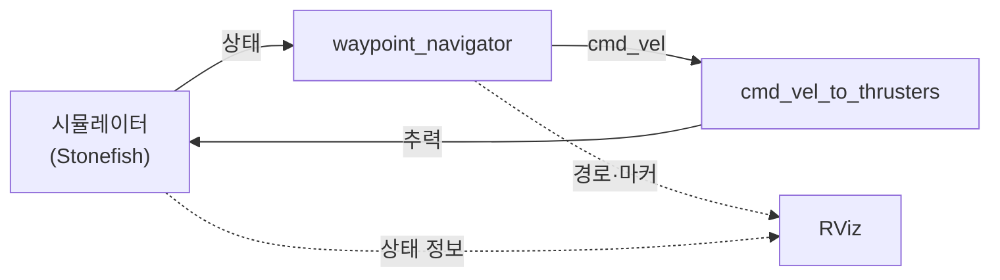

# Docker (`docker/`)

Stonefish 서브모듈 `stonefish/`는 수정하지 않고, 빌드 시 `--build-context stonefish=./stonefish` 로 소스만 넘깁니다. **ROS 2 Jazzy** 기준.

## 개념도

**웨이포인트 런치 예** (`girona500_waypoint_test`): 시뮬이 AUV **상태**(위치·자세 등)를 보내고 → `waypoint_navigator`가 **`cmd_vel`** 을 내고 → `cmd_vel_to_thrusters`가 **추력 명령**으로 바꿔 시뮬에 다시 줍니다(닫힌 제어 루프). **RViz**는 경로·마커·TF 등을 **보여 주기만** 합니다(TF는 `odom_to_tf`, `robot_state_publisher` 등이 중간에서 이어 줌). **EROAS·MVP** 런치는 노드가 달라질 수 있습니다.



### 웨이포인트 스택 토픽 (`girona500_waypoint_test` 기준)

아래는 **GIRONA500 AUV** 웨이포인트 런치에서 쓰는 토픽·메시지 요약입니다. EROAS·MVP 등 다른 런치는 다를 수 있습니다.

| 노드 | subscribe | publish |
|------|-----------|---------|
| **시뮬레이터** (+ 내부 브리지) | `…/ThrusterSurgePort/setpoint` 등 5개 (`std_msgs/msg/Float64`) | `/GIRONA500/dynamics` (`nav_msgs/msg/Odometry`) |
| **waypoint_navigator** | `/GIRONA500/dynamics` | `/GIRONA500/cmd_vel` (`geometry_msgs/msg/Twist`), `/waypoint_nav/planned_path`, `/waypoint_nav/traveled_path` (`nav_msgs/msg/Path`), `/waypoint_nav/visualization_markers` (`visualization_msgs/msg/MarkerArray`) |
| **cmd_vel_to_thrusters** | `/GIRONA500/cmd_vel` | 위 5개 thruster `…/setpoint` (`std_msgs/msg/Float64`) |
| **odom_to_tf** (`stonefish_ros2`) | `/GIRONA500/dynamics` (`nav_msgs/msg/Odometry`, 스크립트에 고정) | `/tf` (브로드캐스트, 예: `GIRONA500/world_ned` → `GIRONA500/base_link`) |
| **robot_state_publisher** | `/joint_states` (런치에 소스가 있으면) | `/tf` (URDF 링크) |
| **static_transform_publisher** (런치에 포함 시) | — | `/tf_static` |
| **rviz2** | 설정(`waypoint_navigation.rviz` 등)에 따름. 보통 `/tf`, `/tf_static`, `/waypoint_nav/*` 경로·마커 | — |

5개 추력 토픽: `ThrusterSurgePort`, `ThrusterSurgeStarboard`, `ThrusterHeaveBow`, `ThrusterHeaveStern`, `ThrusterSway` (각 `/GIRONA500/…/setpoint`).

## 이미지

| 태그 | 파일 | 설명 |
|------|------|------|
| **`projectalpha:jazzy-integrated`** | [`integrated/Dockerfile`](integrated/Dockerfile) | Stonefish `/usr/local` + 전체 워크스페이스 `/ws/install` |

**내용:** Stonefish C++ 라이브러리를 `/usr/local`에 설치한 뒤, 저장소 **`src/` 전체**를 `colcon build` 합니다.

**upstream Stonefish `Tests/` 실행 파일**(ConsoleTest 등)은 이 Dockerfile에서 빌드하지 않습니다.

- 베이스: `osrf/ros:jazzy-desktop-full`
- `colcon build`에 **`--symlink-install` 없음** (`stonefish_ros2/data/` 대용량 설치 이슈 회피)

## 빌드

저장소 루트에서 (**`stonefish` 서브모듈 필요**):

```bash
docker buildx build \
  -f docker/integrated/Dockerfile \
  --build-context stonefish=./stonefish \
  -t projectalpha:jazzy-integrated \
  --load \
  .
```

## 컨테이너 실행 (공통)

그래픽·RViz·Stonefish 창이 필요하면 호스트에서 X11을 넘깁니다.

```bash
xhost +local:docker
docker run --rm -it --network host \
  -e DISPLAY \
  -v /tmp/.X11-unix:/tmp/.X11-unix \
  projectalpha:jazzy-integrated bash
```

컨테이너 안:

```bash
source /ws/install/setup.bash
ros2 launch eroas_navigation girona500_waypoint_test.launch.py
```

또는 아래 표의 다른 `ros2 launch …` 명령을 같은 전제(`source /ws/install/setup.bash`, 필요 시 `DISPLAY`)로 실행하면 됩니다.

- 일부 런치는 **`xterm`** 으로 보조 창을 띄웁니다. 이미지에 `xterm`이 포함되어 있으며, Docker 실행 시 위와 같이 `DISPLAY`가 있어야 합니다.
- **키보드 텔레옵** 런치는 터미널 포커스·`-it`가 필요합니다.
- **GPU**는 호스트 NVIDIA Container Toolkit 등으로 `--gpus all` 등을 추가할 수 있습니다(선택).

**시나리오 데이터**: `girona500auv_console.scn` 및 GIRONA500 메시는 빌드 시 `stonefish/Tests/Data`에서 `stonefish_ros2/data/`로 복사됩니다.

---

## `eroas_navigation` — GIRONA500 + EROAS / FLS / 웨이포인트

| 명령 | 설명 |
|------|------|
| `ros2 launch eroas_navigation girona500_waypoint_test.launch.py` | 멀티 웨이포인트 + 시뮬·시각화(기본 데모) |
| `ros2 launch eroas_navigation girona500_eroas.launch.py` | EROAS 단일 목표 내비 |
| `ros2 launch eroas_navigation girona500_fls_test.launch.py` | FLS 시나리오 + EROAS 파이프라인 |
| `ros2 launch eroas_navigation girona500_fls_obstacle_course.launch.py` | FLS 장애물 코스 |
| `ros2 launch eroas_navigation girona500_eroas_canyon.launch.py` | 캐니언 시나리오 + EROAS |

**상세 절차·기대 동작**은 저장소 루트의 다음 문서를 우선 참고하는 것이 좋습니다.

- [`WAYPOINT_TEST_GUIDE.md`](../WAYPOINT_TEST_GUIDE.md)
- [`EROAS_WAYPOINT_TEST_GUIDE.md`](../EROAS_WAYPOINT_TEST_GUIDE.md)
- [`FLS_TEST_GUIDE.md`](../FLS_TEST_GUIDE.md)
- [`PROJECT_TEST_GUIDE.md`](../PROJECT_TEST_GUIDE.md)

---

## `stonefish_ros2` — MVP / 시뮬만 / 텔레옵

| 명령 | 설명 |
|------|------|
| `ros2 launch stonefish_ros2 girona500_mvp.launch.py` | 시뮬 + **`mvp_control`** + `mvp_helm` + 텔레옵 등 풀 스택 |
| `ros2 launch stonefish_ros2 girona500_mvp_sim_only.launch.py` | 시뮬 + `mvp_helm` (**`mvp_control` 없음**) + 텔레옵·센서 모니터 등 — 추력은 텔레옵이 직접 토픽 발행 |
| `ros2 launch stonefish_ros2 girona500_mvp_rviz.launch.py` | MVP + RViz |
| `ros2 launch stonefish_ros2 stonefish_simulator.launch.py` | 시뮬레이터 노드만 (인자로 `simulation_data`, `scenario_desc` 등) |
| `ros2 launch stonefish_ros2 stonefish_simulator_nogpu.launch.py` | GPU 없이 돌리는 시뮬 변형(인자 필요) |
| `ros2 launch stonefish_ros2 girona500_teleop.launch.py` | GIRONA500 키보드 텔레옵 |
| `ros2 launch stonefish_ros2 custom_auv_teleop.launch.py` | 커스텀 AUV 텔레옵 |
| `ros2 launch stonefish_ros2 custom_auv_test.launch.py` | `custom_auv.scn` 기반 테스트 |

MVP 설치·통합 설명은 [`MVP_INSTALLATION_GUIDE.md`](../MVP_INSTALLATION_GUIDE.md), [`MVP_Integration_Report.md`](../MVP_Integration_Report.md) 등을 참고하세요.

---

## 정리

- 이미지는 통합 빌드이므로, 위 표의 `ros2 launch` 는 **동일한 전제**(환경 소스, X11 필요 시 `DISPLAY`)만 맞추면 됩니다.
- 동작·시나리오별 체크리스트는 루트의 **`*_GUIDE.md` / `*_Report.md`** 를 함께 보는 것을 권장합니다.

## 참고

- [`.dockerignore`](../.dockerignore) — 빌드 컨텍스트에서 제외할 항목
